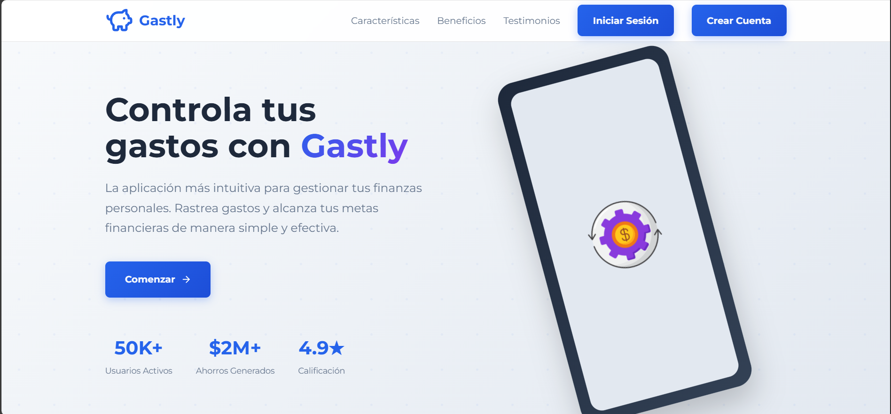

# Gastly - Control y Manejo de Gastos Personales 💰

Aplicación web para el **control y manejo de gastos personales**, permitiendo registrar, filtrar, visualizar y analizar tus finanzas de forma sencilla y rápida.



## ✍️ Características

- Creación de gastos
- Formulario para editar un gasto
- Búsqueda de gastos por titulo
- Visualización de gastos en una tabla
- Filtrado de gastos por activos/borrados
- Se hace uso de un softdelete no se realizan borrados fisicos
- Representación de gastos en graficos (barra, metricos y de pastel)
- Interfaz responsiva y atractiva con animaciones y glassmorphism.
- Estado global gestionado con Redux Toolkit.
- **Backend propio** para proteger la clave de la API y servir los datos al frontend.
- Consumo de API creada en Node - ExpressJS
- Mapeo de una base de datos utilizando Prisma ORM

## 👨‍💻 Tecnologías utilizadas

- React JS
- Vite
- TypeScript
- Redux Toolkit
- Tailwindcss
- Node.js + Express (Backend)
- Prisma
- PostgrSQL (supabase)

[](https://skillicons.dev)

<details><summary><b>Estructura del proyecto</b></summary>

```bash
Expense-Tracker/
├── .github/
│   └── assets/
│       └── gasty.png
├── expense-api/
│   ├── common/
│   │   ├── validations/
│   │   │   ├── auth/
│   │   │   │   └── authValidations.js
│   │   │   ├── expense/
│   │   │   │   └── expenseValidations.js
│   │   │   ├── user/
│   │   │   │   └── userValidations.js
│   │   │   ├── common_validations.js
│   │   │   └── handle_request.js
│   ├── controllers/
│   │   ├── auth.controller.js
│   │   ├── expense.controller.js
│   │   └── user.controller.js
│   ├── middlewares/
│   │   ├── authMiddleware.js
│   │   └── corsMiddleware.js
│   ├── prisma/
│   │   ├── migrations/
│   │   └── schema.prisma
│   ├── routes/
│   │   ├── auth.route.js
│   │   ├── expense.route.js
│   │   └── user.route.js
│   ├── route/
│   │   ├── auth.service.js
│   │   ├── expense.service.js
│   │   └── user.service.js
│   │
│   ├── .env
│   ├── .gitignore
│   ├── index.js
│   ├── package-lock.json
│   ├── package.json
│   ├── Procfile
│   └── READMI.md
├── frontend/
│   ├── public/
│   │   └── pig.png
│   ├── src/
│   │   ├── assets/
│   │   │   ├── expense-img.png
│   │   │   ├── expense-movil.png
│   │   │   ├── expense.svg
│   │   │   └── man.png
│   │   ├── components/
│   │   │   ├── expense/
│   │   │   │   ├── add/
│   │   │   │   │   └── ExpenseDrawer.tsx
│   │   │   │   ├── charts/
│   │   │   │   │   ├── CategoryDoughnutChart.tsx
│   │   │   │   │   ├── ChartCards.tsx
│   │   │   │   │   ├── ExpenseBarChart.tsx
│   │   │   │   │   └── MetricCard.tsx
│   │   │   │   ├── edit/
│   │   │   │   │   └── FormEditExpense.tsx
│   │   │   │   ├── form/
│   │   │   │   │   ├── Calendar.tsx
│   │   │   │   │   └── CreatedExpenseForm.tsx
│   │   │   │   ├── table/
│   │   │   │   │   ├── Filters.tsx
│   │   │   │   │   ├── HeaderTable.tsx
│   │   │   │   │   ├── ListOfExpenses.tsx
│   │   │   │   │   ├── Search.tsx
│   │   │   │   │   └── TableExpenses.tsx
│   │   │   ├── layout/
│   │   │   │   ├── Loading.tsx
│   │   │   │   ├── NavBar.tsx
│   │   │   │   └── SideBar.tsx
│   │   │   ├── routes/
│   │   │   │   └── PrivatedRoute.tsx
│   │   │   ├── session/
│   │   │   │   └── SessionWatcher.tsx
│   │   ├── hooks/
│   │   │   └── store.ts
│   │   ├── pages/
│   │   │   ├── DashboardPage.tsx
│   │   │   ├── LandingPage.tsx
│   │   │   ├── LoginPage.tsx
│   │   │   ├── NotFoundPage.tsx
│   │   │   ├── ProfilePage.tsx
│   │   │   └── RegisterPage.tsx
│   │   ├── service/
│   │   │   └── api.ts
│   │   ├── store/
│   │   │   ├── slices/
│   │   │   │   ├── authSlice.ts
│   │   │   │   └── expenseSlice.ts
│   │   │   ├── thunks/
│   │   │   │   ├── auth.thunk.ts
│   │   │   │   ├── expense.thunk.ts
│   │   │   │   └── user.thunk.ts
│   │   │   └── index.ts
│   │   ├── styles
│   │   │   ├── CreatedExpenseForm.css
│   │   │   ├── DashBoard.css
│   │   │   ├── Filters.css
│   │   │   ├── FormEditExpense.css
│   │   │   ├── HeaderTable.css
│   │   │   ├── LandingPage.css
│   │   │   ├── LoginPage.css
│   │   │   ├── Navbar.css
│   │   │   ├── NotFoundPage.module.css
│   │   │   ├── ProfilePage.css
│   │   │   ├── RegisterPage.css
│   │   │   ├── Search.css
│   │   │   ├── Sidebar.css
│   │   │   └── TableExpense.css
│   │   ├── App.css
│   │   ├── App.tsx
│   │   ├── const.ts
│   │   ├── index.css
│   │   ├── main.tsx
│   │   ├── types.d.ts
│   │   └── vite-env.d.ts
│   ├── .env
│   ├── .gitignore
│   ├── eslint.config.js
│   ├── index.html
│   ├── package-lock.json
│   ├── package.json
│   ├── README.md
│   ├── tsconfig.app.json
│   ├── tsconfig.json
│   ├── tsconfig.node.json
│   └── vite.config.ts
├── README.md
```

</details>

## 🧰 Get Started

Para poner este proyecto en funcionamiento en su entorno de desarrollo, siga estas instrucciones paso a paso.

### ⚙️ Instalación & Correrlo en Local

**Step 0:**

Note :bangbang: **Backend:** La aplicación utiliza autenticación con JWT. Por lo que se deben declarar las siguientes variables de entorno:
`JWT_SECRET` y `SALT_ROUNDS` en el archivo `.env`.

Note :bangbang: **Backend:** En la web API se usa Prisma ORM para el mapeo de las tablas de la base de datos. Por lo que se debe declarar una url en la variable de entorno:
`DATABASE_URL` en el archivo `.env`.

**Step 1:**

Descargue o clone este repositorio utilizando el siguiente enlace:

```bash
git clone https://github.com/LFernando07/Expense-Tracker.git
```

**Step 2:**

Ir al backend
Ejecute el siguiente comando en el directorio para instalar las dependencias:

```bash
cd expense-api
npm/pnpm install
```

**Step 3:**
Ejecute el siguiente comando para ejecutar el servidor de desarrollo localmente:
El backend se ejecutará normalmente en [http://localhost:3000](http://localhost:3000).

```bash
npm/pnpm run dev
```

**Step 4:**

Ir al frontend
Ejecute el siguiente comando en el directorio para instalar las dependencias:

```bash
cd expense-ui
npm/pnpm install
```

**Step 5:**

Ejecute el siguiente comando para ejecutar el frontend en el navegador:
El frontend se ejecutará en [http://localhost:5173](http://localhost:5173).

```bash
npm/pnpm run dev
```

## 🔒 Environment Variables

Las variables de entorno se pueden usar para la configuración. Deben configurarse antes de ejecutar la aplicación.

**Expense_Tracker_App** conocido como Gastly usa [PrismaORM](https://www.prisma.io/) accede a la página oficial para poder utilizar la dependencia.

Cree un archivo `.env` en el directorio raíz del proyecto (backend) y agregue las siguientes variables de entorno:

```env
DATABASE_URL=<DATABASE_URL>
```

Ademas de que la aplicación utiliza en la API JSONWEBTOKEN para la autenticación se debe instalar la dependencia **npm/pnpm i jsonwebtoken**
y agegar en `.env` las siguientes variables de enterno:

```env
JWT_SECRET = <VALOR_JWT_SECRET>
SALT_ROUNDS=<VALOR_NUMERICO>

```

## 📋 Licencia

**Gasty_App** es software de código abierto
— Ver [licensed as MIT](https://opensource.org/license/mit/) y es de uso gratuito
